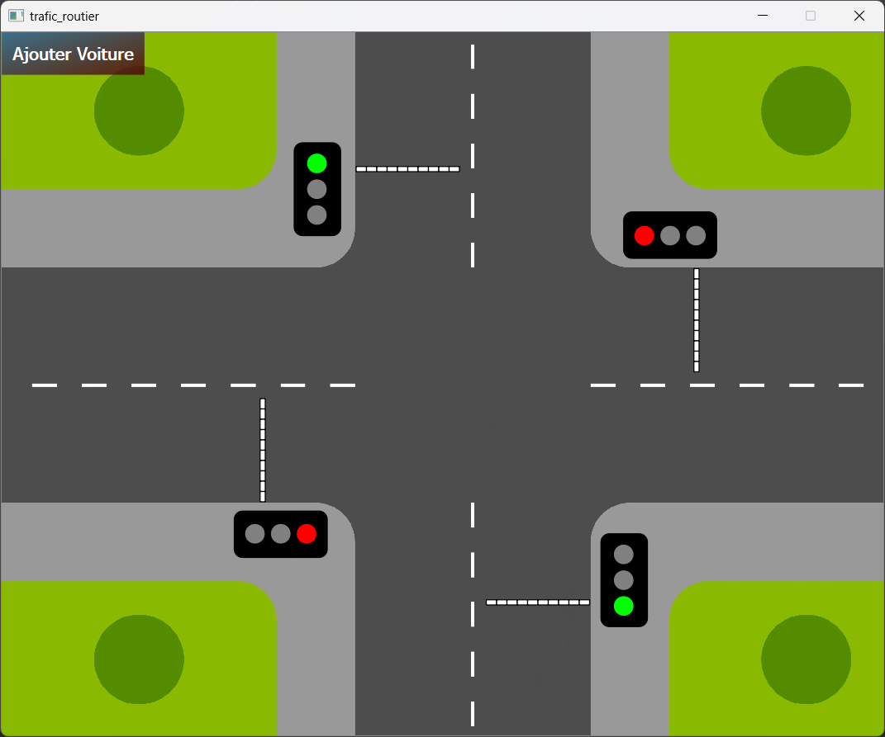
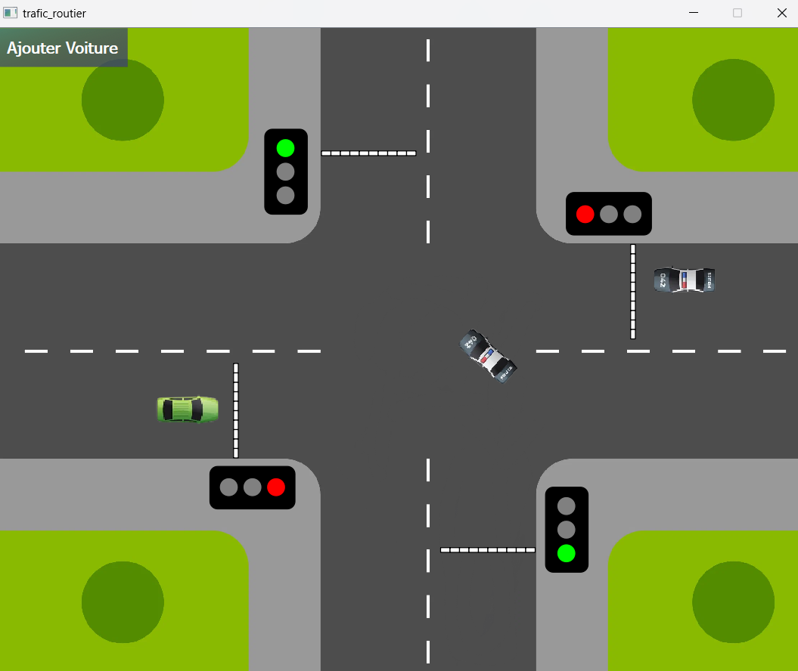
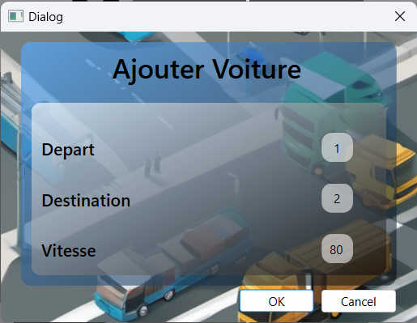

# Traffic Light Simulator

## Overview

The **Traffic Light Simulator** app is a desktop application project made with C++ and Qt Creator framework, simulating traffic signals on a road network. The app helps visualize traffic flow, test basic traffic management, and understand how signals affect the movement of vehicles.



## Technology Used

The **Traffic Light Simulator** was developed using the following technologies:

- **C++**: The core programming language used to implement the logic of the simulator.
- **Qt Creator**: The integrated development environment (IDE) used for building and managing the project, especially for creating the graphical user interface (GUI).
- **Qt Library**: A library used for creating the graphical widget.
- **CMake**: Used for managing the build system and dependencies for the project.

## Features

- **Dynamic Traffic Flow:** Simulates vehicle movement on roads, adjusting vehicle speed and behavior in real-time.
- **Traffic Light Control:** Implements traffic signal systems.
- **Vehicle Types:** Contains multiple vehicle types, including cars, trucks, and motorcycles.
- **Real-Time Simulation:** Visualizes the simulation in real-time with a graphical interface.



## Requirements

Before you start using the simulator, ensure you have the following:

- Qt Creator version `6.6.1` or above
- CMake Build Kit installation within Qt Creator

## Installation

1. Clone or download the repository to your local machine.

    ```bash
    git clone https://github.com/Sam-uu/Traffic-Light-Simulator.git
    ```

2. Navigate to the project directory.

    ```bash
    cd trafic_routier
    ```

3. Open `trafic_routier.pro` with Qt Creator

## Usage



You can start the simukation by adding cars using the `Ajouter Voiture` button on the top left.
The button opens a widget with which you can:

- Add the vehicle's point of `origin`
- Add the vehicle's `destination` point
- Control the vehicle's `speed`

## Contributor

**Ismael Fericha**
- Linkedin : https://www.linkedin.com/in/ismael-fericha/
- GitHub : https://github.com/Sam-uu
